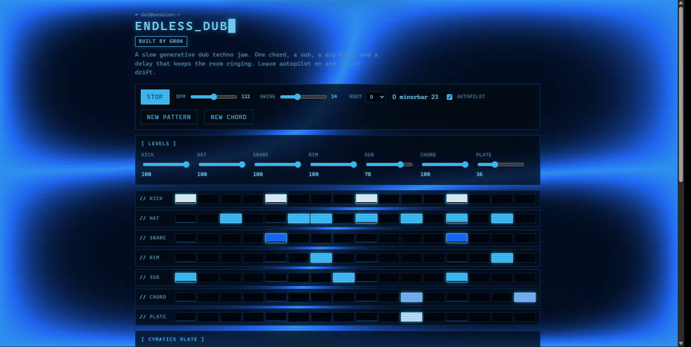

# Endless Dub

Generative dub techno in the browser. Open `index.html`, press Play.

Slow tempo, a dry kick, a sine sub, open minor and sus chords, and a filtered ping-pong delay. Autopilot drifts the filter, nudges the pattern, changes chord every few dozen bars, and occasionally drops the kick for four bars.

The lean-back session — step grids, autopilot, one-button regenerate — follows [Vitling’s Endless Acid Banger](https://www.vitling.xyz/toys/acid-banger/) and [Zykure’s spicy version](https://zykure.github.io/acid-banger/) (CC BY 4.0). The synthesis and patterns here are a separate piece written for dub.

Live: https://xyzzyapps.github.io/endless_dub/

## Assumptions

The starting pattern, the step weights, and the knob positions are the visible assumptions. The generator also has rules that stay in effect after those are edited.

* A new kick only lands on the four downbeats. The closed hat on step 1 stays off. The snare prefers the backbeat. The open hat, rim, sub, chord, and plate each draw from a short list of steps. A weight of zero makes a step unlikely. It does not invent steps outside that list.
* The key starts on D minor. Chord changes move by a fixed set of intervals. The voicing is one of three open shapes, chosen from the bar number.
* Tempo starts at 122. The delay starts as a dotted eighth. The plate starts silent. Cutoff glide, Muteouts, and Swing start on. Delay send, Width, and Resonance start off. Feedback cannot drift above 0.75.
* Waveforms, plate mode ratios, kick ducking, and the stereo width circuit are fixed. No control rewrites them.

A saved song would store the pattern, every step weight, and the knob values. **New pattern** would still follow the rules above.

## License

[PolyForm Noncommercial License 1.0.0](https://polyformproject.org/licenses/noncommercial/1.0.0). Noncommercial use only.

Required Notice: Copyright 2026 Xyzzy Apps (xyzzyapps@gmail.com)
