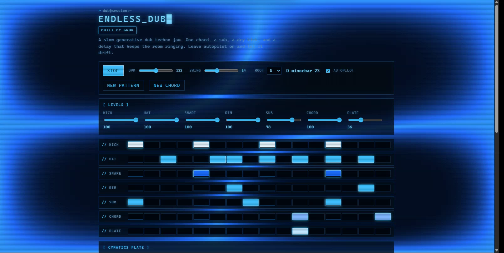

# Endless Dub

Generative dub techno in the browser. Open `index.html`, press Play.

Slow tempo, a dry kick, a sine sub, open minor and sus chords, and a filtered ping-pong delay. Autopilot drifts the filter, nudges the pattern, changes chord every few dozen bars, and occasionally drops the kick for four bars.

The lean-back session — step grids, autopilot, one-button regenerate — follows [Vitling’s Endless Acid Banger](https://www.vitling.xyz/toys/acid-banger/) and [Zykure’s spicy version](https://zykure.github.io/acid-banger/) (CC BY 4.0). The synthesis and patterns here are a separate piece written for dub.

Live: https://xyzzyapps.github.io/endless_dub/

A phone plays through the Csound engine. A computer keeps the original Web Audio graph.

Support on https://xyzzy.gumroad.com/

## Assumptions

The starting pattern, the step weights, and the knob positions are the visible assumptions. The generator also has rules that stay in effect after those are edited.

* A new kick only lands on the four downbeats. The closed hat on step 1 stays off. The snare prefers the backbeat. The open hat, rim, sub, chord, and plate each draw from a short list of steps. Each step weight is 0 to 100. Zero is never chosen. It does not invent steps outside that list.
* The key starts on D. The stab cycles through the same three open shapes as before, one per bar, and a chord change only transposes that cycle. The sub and the plate stay on the key. The chord menu lists the minor-key neighbours of the root. Harmonise keeps New chord and autopilot inside that list. With Harmonise off, a new chord can start on any pitch.
* Tempo stays in beats per minute and starts at 122. Cutoff is in hertz and starts at 680. Feedback is the percent sent back around the delay, from 20 to 88, and starts at 70. Note lengths are in milliseconds. The other sliders are 0 to 100 across their own range. The delay starts as a dotted eighth. The plate starts silent. Cutoff glide, Muteouts, and Swing start on. Delay send, Width, and Resonance start off. Feedback cannot drift above 0.75.
* Waveforms, plate mode ratios, kick ducking, and the stereo width circuit are fixed. No control rewrites them.

Cutoff glides continuously. Weight 20 keeps it near ±20 Hz. Weight 100 can move about ±800 Hz and picks a new spot about every third of a second.

The other autopilot knobs glide the same way. The weight is how far they may wander and how soon they pick a new spot. At 100 the reach is:

| Weight | Reach |
|---|---|
| Feedback | ±14%, and it will not go above 75% |
| Damp | ±1400 Hz |
| Reverb | ±28% |
| Decay | ±220 ms |
| Delay send | ±28% |
| Width | ±28% |
| Resonance | ±7 |
| Swing | ±0.16 |

At 100, pattern and chord are checked about every 4 bars, and a breakdown about every 8. A chord change still waits out the 16-bar hold. A lower weight waits longer and moves less.

A saved song would store the pattern, every step weight, and the knob values. **New pattern** would still follow the rules above.

## License

[PolyForm Noncommercial License 1.0.0](https://polyformproject.org/licenses/noncommercial/1.0.0). Noncommercial use only.

Required Notice: Copyright 2026 Xyzzy Apps (xyzzyapps@gmail.com)
